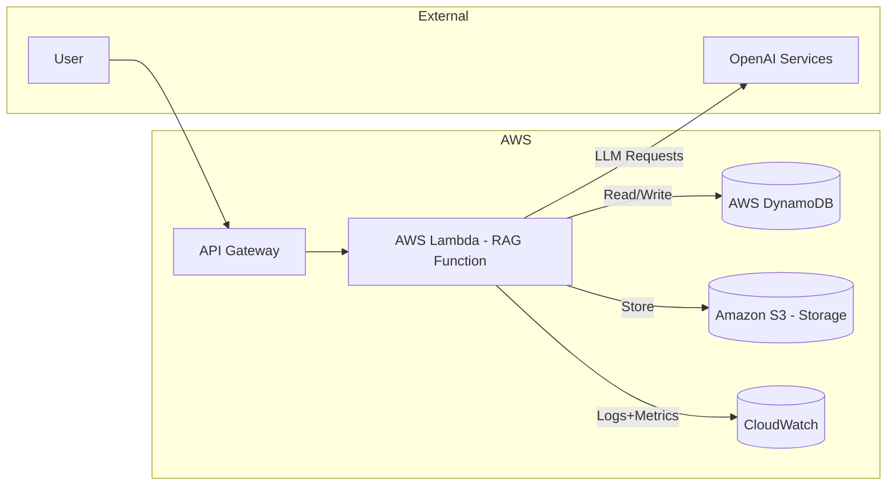

```markdown
# Preliminary Design Review — RAG API
**Version:** 1.0  
**Date:** 2023-MM-DD  
**Status:** Draft  
**Author:** SaaS Infrastructure Agent — Design Module  
**Cloud Provider:** AWS  
**Reviewed By:** Pending

## Executive Summary

This document outlines the preliminary design for a serverless RAG API targeting 10,000 daily users with a requirement of handling up to 500 queries per second and maintaining p95 latency under 2 seconds. The architecture leverages AWS serverless services to ensure scalability and cost efficiency within a single AWS region, while relying on external integrations with OpenAI for LLM inference and embeddings processing. The emphasis is on delivering low latency and high concurrency without specific compliance constraints.

## Requirements Summary

| # | Requirement | Value | Source |
|---|---|---|---|
| R1 | Workload type | Serverless RAG API | User input |
| R2 | Expected RPS / concurrency | 500 QPS peak | User input |
| R3 | Data residency / compliance | No special requirements | User input |
| R4 | Availability target | N/A | Assumption |
| R5 | Budget ceiling (monthly) | Unknown | Open issue |

## Architecture Overview

### 4.1 Architecture Pattern

The selected architecture pattern is a Serverless event-driven model using API Gateway and Lambda functions, which is ideal for handling variable workloads with high requests per second (RPS), offering inherent scalability without manual infrastructure management. The serverless model minimizes operational overhead and optimizes cost efficiency, aligning with the project's requirements for AWS integration and cost sensitivity.

### 4.2 Architecture Diagram (text)



### 4.3 AWS Services Selected

| Service | Config / Tier | Justification | Alternative Considered |
|---|---|---|---|
| AWS Lambda | 1024MB memory, 1vCPU | Auto scales to support serverless workload with no management needed | ECS Fargate (manual scaling efforts) |
| Amazon API Gateway | HTTP API | Fully managed API service integrating with Lambda for easy scalability | AWS App Runner (doesn't fit event-driven model) |
| AWS DynamoDB | On-demand billing | Scales to demand peaks without capacity planning | Amazon RDS (requires manual scaling)|
| Amazon S3 | Standard Storage | Durable storage for logs and backups | Glacier (for cold storage only) |
| AWS Secrets Manager | N/A | Secure API credential storage with auto-rotation | SSM Parameter Store (less automation features) |
| Amazon CloudWatch | Default | Comprehensive monitoring of AWS resources | Datadog (additional integration and costs) |

## Network & Security Design

### 5.1 VPC Layout

No VPC required — all services are fully managed AWS endpoints.

### 5.2 Security Posture

| Control | Approach |
|---|---|
| Authentication | API Keys via AWS API Gateway |
| Authorization | IAM roles with least privilege policy for Lambda execution |
| Secrets management | AWS Secrets Manager for API keys |
| Encryption at rest | Default by AWS service |
| Encryption in transit | TLS 1.2+ enforced |
| WAF | Integrated with API Gateway |
| Logging | CloudWatch logs for Lambda functions and API Gateway |

### 5.3 IAM Design

- **`lambda-execution-role`** — Execute API Gateway requests, access DynamoDB, manage logs in CloudWatch, read from S3.
- **`secrets-access-role`** — Access to AWS Secrets Manager for retrieving API keys.

## Data Architecture

### 6.1 Data Stores

| Store | Service | Schema / Structure | Retention | Backup |
|---|---|---|---|---|
| Main Data Store | DynamoDB | NoSQL – Document-based | N/A | Managed by AWS |
| Log Storage | S3 | N/A | 90 days | Lifecycle policies to Glacier |

### 6.2 Data Flow

Data enters the system through the API Gateway, triggering AWS Lambda to process each request. Lambda reads and writes from DynamoDB to manage API state and uses OpenAI services for model inference. Logs and performance metrics are recorded in CloudWatch, and user inputs are optionally stored in S3. No special handling for PII is needed as per provided requirements.

## Scalability & Availability Design

### 7.1 Scaling Strategy

| Component | Scaling Mechanism | Min | Max | Trigger |
|---|---|---|---|---|
| Lambda | Auto-scaling | 1 | 1000 | QPS spikes |
| DynamoDB | Auto-scaling | On-demand | On-demand | Varies with throughput |

### 7.2 Availability Targets

| Tier | Target SLA | How achieved |
|---|---|---|
| API | Serverless default | Redundant regional endpoints |
| Lambda | Managed | Due to statelessness; retries on failure |
| Overall System | Serverless default | Achieved inherently with stateless design and AWS managed services |

### 7.3 Fault Tolerance

1. **Service interruption (Lambda)** → AWS retries and multi-region fallback (possible extension).
2. **API Gateway outage** → Alternative regional endpoints as next steps.
3. **DynamoDB throughput limit breach** → Switch to provisioned capacity for high-demand scenarios.

## Cost Estimate

Provide a **monthly rough-order-of-magnitude estimate** based on expected usage patterns.

| Service | Config | Est. Monthly Cost |
|---|---|---|
| AWS Lambda | 500K requests/month | ~$100 |
| API Gateway | 500K requests/month | ~$50 |
| DynamoDB | On-demand capacity | ~$100 |
| S3 | 1TB with basic storage | ~$25 |
| CloudWatch | Metrics, logs | ~$20 |
| Secrets Manager | ~10 secrets | ~$10 |
| **Total** | | **~$305/month** |

### Cost Optimization Options

1. **Reserved Lambda executions**: Reduce costs via AWS Savings Plans.
2. **Reduce API Gateway logs**: Log only errors or adjust log retention policies.
3. **Optimize DynamoDB capacity**: Implement usage prediction for potential switching to provisioned capacity.

## Operational Design

### 9.1 Observability Stack

| Signal | Service | Retention |
|---|---|---|
| Metrics | AWS CloudWatch | 15 months |
| Logs | CloudWatch Logs | 90 days |
| Traces | AWS X-Ray | 30 days |
| Dashboards | CloudWatch Dashboards | N/A |
| Alerts | SNS to Email/Slack | Immediate |

### 9.2 Deployment Strategy

- **Pipeline:** GitHub Actions for CI/CD.
- **Strategy:** Rolling updates with health checks.
- **Rollback:** Automatic rollback on failure.
- **IaC:** Terraform for AWS resource management.

### 9.3 Runbook Pointers

1. **Lambda scaling issue** — Adjust concurrency limits in AWS Lambda Management Console.
2. **Throttle API Gateway** — Rate limit in AWS API Gateway settings.
3. **Increase DynamoDB capacity** — Switch to provisioned throughput as needed.

## Open Issues & Assumptions

| # | Item | Type | Resolution needed by |
|---|---|---|---|
| A1 | Domain name / Route 53 hosted zone not specified | Assumption | Build start |
| A2 | SSL certificate — ACM or bring-your-own? | Open issue | Human approval |

## Approval Sign-Off

```
Architecture reviewed and approved for Build Agent execution.

Approved by: ___________________  Date: ___________
Comments: 
```
```
