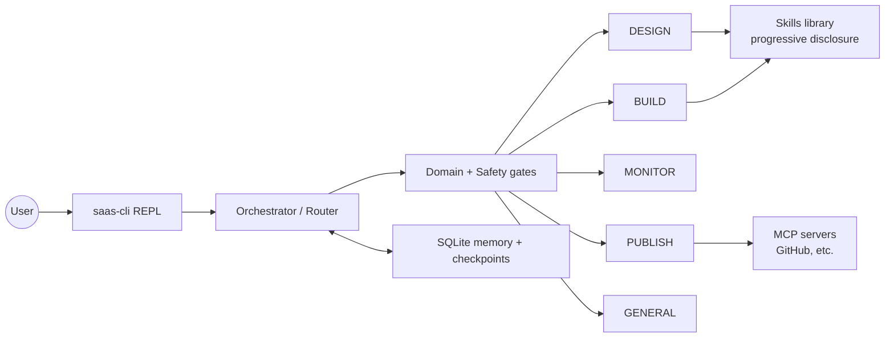

# SaaS Infra Agent

SaaS Infra Agent is an AI agent CLI that turns plain-language infrastructure requirements (for example: "we need a RAG pipeline for 10,000 daily users with sub-2s latency") into an approved design (`pdr.md`), runnable IaC artifacts, and operational guidance.

The REPL routes each message to an infra-focused agent via the orchestrator (`saas_infra_agent/agent/orchestrator.py`):

| Agent   | What it does |
|--------|--------------|
| DESIGN | Clarifies requirements and produces an approved plan/design doc (`pdr.md`). |
| BUILD  | Generates Terraform artifacts (and other deployables like Docker/Compose/K8s), validates them, and deploys to the target cloud. In the initial phase of this project, deployments are done against a cloud emulator (Floci) to simulate AWS locally. |
| MONITOR | Helps with observability and ops: metrics, token usage, cost signals, and optimization recommendations. (Work In-Progress) |
| PUBLISH | Publishes generated artifacts (for example to GitHub) via MCP integrations. |

More details: `saas_infra_agent_design.md`.

## Architecture (high level)



Key runtime concepts:

- Routing: orchestrator selects the agent each turn and resumes paused agents before normal routing (so replies like `approve` are accepted).
- Gating: infra-only domain gate + safety gate before agent invocation.
- Approvals/interrupts: sensitive steps (plan approval, local validation loops) pause and resume via interrupts.
- Progressive disclosure skills: BUILD loads only the skills it needs from `saas_infra_agent/skills/**/SKILL.md`.
- Sandboxed artifact writing: generated IaC/artifacts are written via permissioned filesystem tools.
- Memory: short-term conversation state + pending interrupts, plus long-term memory for durable preferences/facts.

## Tech stack

- Language/runtime: Python 3.11+
- Packaging: Poetry (`pyproject.toml`, `poetry.lock`)
- Agent runtime: LangChain + LangGraph (interrupt-driven flows) and `deepagents` (long-running BUILD agent with task plans)
- IaC / delivery: Terraform, Docker, Docker Compose, Kubernetes manifests
- Memory/state: SQLite (checkpointer + build task persistence + long-term store)
- Integrations: MCP servers (for example GitHub publishing)
- Optional services: Qdrant (codebase search), Tavily (web search for MONITOR)

## Concepts used (implementation patterns)

- Multi-agent orchestration with explicit roles (design/build/monitor/publish).
- Human-in-the-loop approvals using interrupt/resume workflows.
- Validation loops with loop-breakers (repeated Terraform failures trigger a stop/continue prompt).
- Skill library as reusable micro-playbooks (progressive disclosure keeps prompts small and consistent).
- Emulator-first deployments in early phases (Floci local AWS emulator for Terraform).

## Setup

Requires Python 3.11+ and Poetry.

```bash
poetry install
```

### Environment

Copy the example env file and fill in your keys:

```bash
cp .env.example .env
```

| Variable | Needed for |
|----------|------------|
| `OPENAI_API_KEY` | Required - all agents (models set in `saas_infra_agent/config.yaml`) |
| `LANGSMITH_API_KEY` | Optional tracing |

Never commit `.env` (and do not put real keys in `.env.example`).

## Run

```bash
poetry run saas-cli
```

The router picks an agent from your message, or you can force one with a prefix:

```
> we need a RAG pipeline for 10,000 daily users    <- routes to DESIGN
> /build generate the infra                        <- forces BUILD
> /monitor what's our token spend?                 <- forces MONITOR
```

Session commands: `/new`, `/switch <id>`, `/session`, `/exit`.

### Typical flow

1. Describe the project - DESIGN asks clarifying questions and saves `pdr.md` after approval.
2. Say "build it" - BUILD reads `pdr.md` and writes IaC into `artifacts/`.
3. Validate/deploy - Terraform validation runs without apply by default; in early-phase mode, deployments can target Floci (local AWS emulator).
4. Monitor - MONITOR can query Prometheus/Cloudwatch for metrics (if configured) or use simulated metrics for demos. - WIP

## Project layout

```
saas_infra_agent/
+-- main.py                  # CLI entry point (poetry run saas-cli)
+-- config.yaml              # Models, memory, limits, artifact dir, deploy settings
+-- agent/
|   +-- orchestrator.py      # Router: design | build | monitor | publish
|   +-- design_agent.py      # Requirements -> approved design (interrupt-driven)
|   +-- build_agent.py       # Plan -> IaC deep agent (todos, skills, sandboxed fs)
|   +-- publish_agent.py     # Publish artifacts via MCP
|   +-- agents.py            # AgentKind + get_agent()
|   +-- tools/               # Read/write/search + Terraform/monitoring tools
+-- skills/                  # Skills library (SKILL.md per skill)
+-- memory/                  # SQLite checkpointer + session handling
+-- mcp/                     # MCP servers, To connect to github
```
