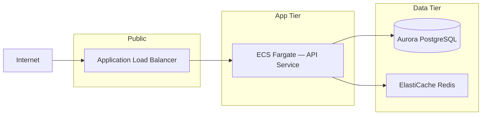

# PDR Document Skill — SaaS Infrastructure Architecture

A **Preliminary Design Review (PDR)** document (`pdr.md`) is the contract between the Design Agent and the Build Agent. It must be **complete enough to drive Terraform generation without ambiguity**, yet **human-readable enough to pass an approval review**. This skill governs structure, completeness rules, quality gates, and writing conventions.

---

## When this skill is used

The Design Agent invokes this skill at the **human approval → save** transition in its StateGraph:

```
classification → requirements_gathering → architecture_draft → human_approval → [THIS SKILL] → save_arch_md
```

It is also invoked by the Orchestrator when checking `arch_md_exists` before routing a Build query — use the **Completeness Gate** section below to evaluate whether an existing file is Build-ready.

---

## PDR Document Structure

Every `pdr.md` MUST contain the following sections in this order. Missing sections block the save step.

### 1. Document Header

```markdown
# Preliminary Design Review — <Application Name>
**Version:** 1.0  
**Date:** YYYY-MM-DD  
**Status:** Draft | Approved  
**Author:** SaaS Infrastructure Agent — Design Module  
**Cloud Provider:** AWS  
**Reviewed By:** <Human approver name or "Pending">
```

### 2. Executive Summary (3–5 sentences)

State what system is being built, the primary workload type, the scale target, and the top architectural constraint (cost, latency, compliance, or availability). No bullet points. Written for a non-technical stakeholder.

### 3. Requirements Summary

Capture the answers gathered during the requirements_gathering stage as a structured table. Every row maps to one clarifying question answered by the user.

| # | Requirement | Value | Source |
|---|---|---|---|
| R1 | Workload type | e.g. Web API + async workers | User input |
| R2 | Expected RPS / concurrency | e.g. 500 RPS peak | User input |
| R3 | Data residency / compliance | e.g. No special requirements | User input |
| R4 | Availability target | e.g. 99.9% | User input |
| R5 | Budget ceiling (monthly) | e.g. ~$2,000 | User input |

Add rows for any additional constraints surfaced during clarification.

### 4. Architecture Overview

#### 4.1 Architecture Pattern

Name the pattern being used and justify the choice in one paragraph. Examples:
- Three-tier VPC (web / app / data layers)
- Serverless event-driven (API Gateway + Lambda + DynamoDB)
- Container-based microservices (ECS Fargate + ALB + RDS Aurora)
- Data lake / batch pipeline (S3 + Glue + Athena + Redshift)
- ML training pipeline (SageMaker + S3 + Step Functions)

Do not invent pattern names. Use the canonical AWS Solutions Library name when one exists.

#### 4.2 Architecture Diagram (text)

Render a Mermaid diagram showing the primary data flow. The diagram MUST show:
- Entry point (user, event source, external service)
- Every AWS service in the design as a labelled node
- Data flow direction with arrows
- Tier/layer groupings using `subgraph`



#### 4.3 AWS Services Selected

List every service used. For each, state the specific tier/configuration and the justification for choosing it over the nearest alternative.

| Service | Config / Tier | Justification | Alternative Considered |
|---|---|---|---|
| ECS Fargate | 2 vCPU / 4 GB tasks, 2–10 replicas | No cluster management; scales to zero on low traffic | EKS (overkill for single-service workload) |
| Aurora PostgreSQL | db.t3.medium, Multi-AZ | Managed failover; compatible with RDS Proxy | RDS PostgreSQL (same but less auto-scaling headroom) |
| ALB | HTTPS only, WAF attached | Layer-7 routing, native ECS integration | NLB (no HTTP routing needed) |

### 5. Network & Security Design

#### 5.1 VPC Layout

```
VPC CIDR: 10.0.0.0/16

Public Subnets (2 AZs):
  10.0.1.0/24  — AZ-a  → ALB, NAT Gateway
  10.0.2.0/24  — AZ-b  → ALB, NAT Gateway

Private App Subnets (2 AZs):
  10.0.11.0/24 — AZ-a  → ECS Tasks
  10.0.12.0/24 — AZ-b  → ECS Tasks

Private Data Subnets (2 AZs):
  10.0.21.0/24 — AZ-a  → RDS, ElastiCache
  10.0.22.0/24 — AZ-b  → RDS, ElastiCache
```

If VPC is not applicable (pure serverless), explicitly state: "No VPC required — all services are fully managed AWS endpoints."

#### 5.2 Security Posture

State each control explicitly. Do not leave any row as "TBD" — infer a sensible default if the user did not specify.

| Control | Approach |
|---|---|
| Authentication | e.g. Amazon Cognito User Pools + JWT |
| Authorization | e.g. IAM roles per service; least-privilege policies |
| Secrets management | e.g. AWS Secrets Manager; no env-var secrets |
| Encryption at rest | e.g. AES-256 via AWS KMS for RDS, S3 |
| Encryption in transit | TLS 1.2+ enforced; ACM certificates on ALB |
| WAF | AWS WAF on ALB — OWASP Core Rule Set enabled |
| Logging | CloudTrail + VPC Flow Logs + ALB access logs → S3 |

#### 5.3 IAM Design

List each service role and its permissions boundary. Use the format:

- **`ecs-task-role`** — Read/Write S3 bucket `app-data-*`; Read Secrets Manager `app/*`; No EC2 or IAM permissions
- **`rds-monitoring-role`** — Enhanced Monitoring only
- **`ci-deploy-role`** — ECS `RegisterTaskDefinition`, `UpdateService`; scoped to this cluster ARN only

### 6. Data Architecture

#### 6.1 Data Stores

| Store | Service | Schema / Structure | Retention | Backup |
|---|---|---|---|---|
| Primary DB | Aurora PostgreSQL | Relational — describe main entities | 7-year (if compliance) or 30 days | Automated daily snapshots |
| Cache | ElastiCache Redis | Key-value session store | TTL-based, no persistence | No backup needed |
| Object store | S3 | User uploads, static assets | Lifecycle → Glacier after 90 days | Versioning enabled |

#### 6.2 Data Flow

Describe how data moves through the system in prose (3–6 sentences). State where data is written, where it is read, and any async fan-out (queues, events). Mention any PII handling or data classification if raised during requirements.

### 7. Scalability & Availability Design

#### 7.1 Scaling Strategy

| Component | Scaling Mechanism | Min | Max | Trigger |
|---|---|---|---|---|
| ECS Service | ECS Application Auto Scaling | 2 | 10 | CPU > 70% |
| Aurora | Aurora Serverless v2 or Read Replicas | — | — | Writer CPU > 80% |
| ALB | AWS-managed (no config needed) | — | — | Automatic |

#### 7.2 Availability Targets

| Tier | Target SLA | How achieved |
|---|---|---|
| Application | 99.9% | Multi-AZ ECS + ALB health checks |
| Database | 99.95% | Aurora Multi-AZ automatic failover |
| Overall system | 99.9% | Weakest link governs |

#### 7.3 Fault Tolerance

List the top 3 failure modes and the mitigation for each:

1. **AZ outage** → Multi-AZ deployment across AZ-a and AZ-b; ALB routes around unhealthy targets automatically.
2. **ECS task crash** → ECS desired count maintained by service scheduler; health check grace period 30s.
3. **Database failover** → Aurora promotes read replica to writer in < 30s; RDS Proxy absorbs connection storm.

### 8. Cost Estimate

Provide a **monthly rough-order-of-magnitude estimate** broken down by service. Flag if the total exceeds the user's stated budget ceiling.

| Service | Config | Est. Monthly Cost |
|---|---|---|
| ECS Fargate | 2 tasks × 2vCPU/4GB, ~720 hrs | ~$120 |
| Aurora PostgreSQL | db.t3.medium Multi-AZ | ~$180 |
| ALB | ~500 RPS average | ~$25 |
| NAT Gateway | ~100 GB/month | ~$45 |
| ElastiCache | cache.t3.micro | ~$25 |
| **Total** | | **~$395/month** |

> ⚠️ Cost Overrun Flag: if total exceeds the R5 budget ceiling, add a "Cost Optimization Options" subsection listing 2–3 specific levers (e.g., Reserved Instances, Savings Plans, right-sizing, removing NAT Gateway with VPC endpoints).

### 9. Operational Design

#### 9.1 Observability Stack

| Signal | Service | Retention |
|---|---|---|
| Metrics | CloudWatch Metrics + Container Insights | 15 months |
| Logs | CloudWatch Logs (structured JSON) | 90 days |
| Traces | AWS X-Ray | 30 days |
| Dashboards | CloudWatch Dashboard (auto-generated by Build Agent) | — |
| Alerts | CloudWatch Alarms → SNS → Slack/Email | — |

#### 9.2 Deployment Strategy

State the CI/CD approach. This drives what the Build Agent generates.

- **Pipeline:** GitHub Actions / AWS CodePipeline (specify which)
- **Strategy:** Blue/Green via ECS deployment circuit breaker OR Rolling update
- **Rollback:** Automatic on health check failure; manual ECS force-redeploy for data migrations
- **IaC:** Terraform (always — this is the Build Agent's output format)

#### 9.3 Runbook Pointers

List the top 3 operational procedures the on-call engineer will need. These become stub runbooks in the Monitor Agent's context.

1. **Scale-out manually** — `aws ecs update-service --desired-count N`
2. **Force Aurora failover** — `aws rds failover-db-cluster`
3. **Roll back deployment** — revert ECS task definition to previous revision

### 10. Open Issues & Assumptions

Any decision that was NOT resolved during requirements gathering must appear here. The Build Agent will not proceed if this section contains unresolved blockers.

| # | Item | Type | Resolution needed by |
|---|---|---|---|
| A1 | Domain name / Route 53 hosted zone not specified | Assumption | Build start |
| A2 | SSL certificate — ACM or bring-your-own? | Open issue | Human approval |

**Rule:** `type = "Open issue"` rows block the Build Agent. `type = "Assumption"` rows are acceptable — they mean the Design Agent made a reasonable default that the human approved.

### 11. Approval Sign-Off

```
Architecture reviewed and approved for Build Agent execution.

Approved by: ___________________  Date: ___________
Comments: 
```

---

## Completeness Gate

Before saving `pdr.md`, verify ALL of the following. A `false` on any item blocks the save and returns the user to the `architecture_draft` stage with a specific gap identified.

```python
REQUIRED_SECTIONS = [
    "Document Header with Status = Approved",
    "Requirements Summary — all 5 rows populated",
    "Architecture Pattern named and justified",
    "Mermaid diagram present and parseable",
    "Services table — every service has a justification",
    "VPC CIDR block defined OR serverless exception stated",
    "All Security Posture rows filled (no TBD)",
    "IAM roles listed",
    "Data stores table — at least one row",
    "Scaling strategy — min/max/trigger for every scalable component",
    "Cost estimate — total present",
    "Cost overrun flag evaluated against R5 budget",
    "Observability stack complete",
    "Deployment strategy — CI/CD tool and strategy named",
    "Open Issues table — no unresolved blockers (type = Open issue)",
    "Approval Sign-Off section present",
]
```

If `arch_md_exists = true` but a Build query arrives and the file fails this gate → Orchestrator routes to Design Agent to fill the gap before Build proceeds.

---

## Writing Conventions

- **Tense:** present tense throughout ("The ALB terminates TLS", not "The ALB will terminate TLS").
- **Service names:** always use the full AWS service name on first use in a section, abbreviation thereafter. ("Amazon Elastic Container Service (ECS Fargate)" then "ECS Fargate").
- **Justifications are mandatory:** every service selection must name the alternative considered and why it was rejected. A table row with an empty "Alternative Considered" cell fails the completeness gate.
- **No filler language:** do not write "This architecture leverages best-in-class AWS services to deliver a robust, scalable solution." State specifics only.
- **Numbers over adjectives:** write "99.9% availability" not "high availability"; write "500 RPS peak" not "high traffic".
- **Diagrams supplement, not replace:** the Mermaid diagram and the Services table must both be present. One does not substitute for the other.

---

## RAG Retrieval Hints for Design Agent

When populating this document, the Design Agent should retrieve in this order:

1. **Skill docs first** — this file and `PATTERNS.md` (service selection patterns)
2. **RAG corpus** — AWS Well-Architected pillar docs, reference architecture for the matched pattern, service limits for every service in the Services table
3. **Web search** — only for: current pricing data (cost estimate section), service limit updates published after RAG corpus cutoff, new AWS service releases

Never populate cost figures from model memory. Always retrieve from web search or AWS Pricing Calculator.

---

## Related Skill Files

| File | Purpose |
|---|---|
| `references/PATTERNS.md` | Canonical architecture patterns, decision tree for pattern selection, per-pattern service defaults |
| `references/SECURITY.md` | Expanded IAM policy templates, security control decision trees, compliance mapping (SOC2, HIPAA, PCI) |
| `references/COST.md` | Cost estimation methodology, per-service pricing levers, reserved instance guidance |
