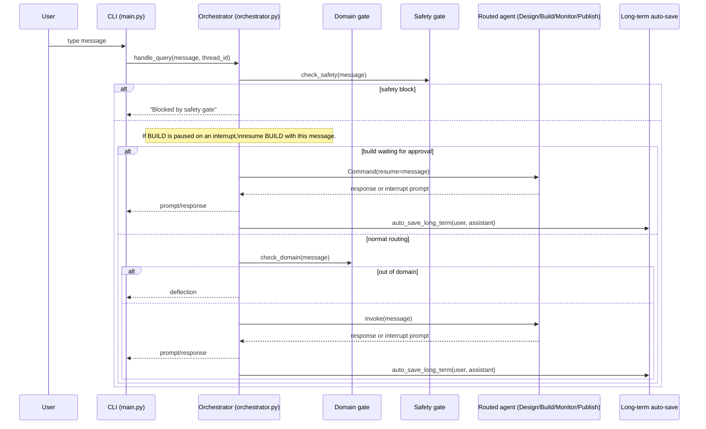

# SaaS Infra Agent — Design & Flow

- Updated: 2026-07-23
- Repo: `saas-cli` (Python/Poetry)

This document describes the architecture of the **SaaS Infra Agent** itself (the CLI and its agent runtime), not the sample app architectures it generates.

## 1. What the system does

`saas-cli` is a REPL that routes each user message to one of the infra-focused agents:

- **DESIGN**: clarifies requirements and produces an approved design doc (`pdr.md`)
- **BUILD**: generates runnable IaC artifacts (Terraform, compose, Dockerfile) and validates them locally
- **MONITOR**: answers monitoring/PromQL questions using Prometheus or simulated metrics
- **PUBLISH**: publishes generated artifacts to GitHub via MCP

Optional extension (not required for the core flow):

- **GENERAL**: a “catch-all” helper agent for safe, non-infra questions (project navigation, terminology, general coding help) so the infra agents can stay tightly scoped.

The CLI enforces:
- **Domain gating** (infra-only) and **safety gating**
- **Human approvals** for sensitive steps (plan approval, local command execution)
- **Persistence** (sessions, task plans, and memories)

## 2. Key files (entry points)

- CLI REPL: `saas_infra_agent/main.py`
- Router/orchestrator: `saas_infra_agent/agent/orchestrator.py`
- Agents:
  - DESIGN: `saas_infra_agent/agent/design_agent.py` (+ design flow graph)
  - BUILD: `saas_infra_agent/agent/build_agent.py` (deepagents)
  - MONITOR: `saas_infra_agent/agent/agents.py` (monitor system prompt + tools)
  - PUBLISH: `saas_infra_agent/agent/publish_agent.py`
- Tools:
  - Terraform validation w/ approval + loop-breaker: `saas_infra_agent/agent/tools/terraform_validate.py`
  - Monitoring tools: `saas_infra_agent/agent/tools/monitoring.py`
  - Long-term memory tools: `saas_infra_agent/agent/tools/long_term_memory.py`
- Config: `saas_infra_agent/config.yaml`

## 3. High-level component diagram

```mermaid
flowchart LR
  user((User))
  cli[saas-cli REPL\nsaas_infra_agent/main.py]
  orch[Orchestrator\nagent/orchestrator.py]
  dg[Domain gate\nagent/domaingate.py]
  sg[Safety gate\nagent/safetygate.py]
  design[DESIGN agent\nLangGraph workflow]
  build[BUILD agent\ndeepagents]
  monitor[MONITOR agent\nLangChain agent]
  publish[PUBLISH agent]
  general[GENERAL agent\n(optional)]

  skills[(Skills library\nsaas_infra_agent/skills/*/SKILL.md)]
  mcp[(MCP servers\nGitHub, ...)]
  floci[(Floci AWS emulator\n(optional local target))]

  st[(Short-term state\n.memory/memory.db\nLangGraph checkpoint)]
  tasks[(Build task plan\nbuild_tasks table\n.memory/memory.db)]
  lt[(Long-term memory\n.memory/long_term.db)]
  logs[(Logs\n.logs/saas-cli.log)]

  user --> cli --> orch
  orch --> dg
  orch --> sg
  orch --> design
  orch --> build
  orch --> monitor
  orch --> publish
  orch -.-> general

  build --> skills
  build -.-> floci
  publish --> mcp
  orch <--> st
  build <--> tasks
  orch --> lt
  cli --> logs
```

## 4. Message routing & approvals (core flow)

### 4.1 One user turn through the CLI



### 4.2 Interrupt/approval model

Some tools pause agent execution using LangGraph interrupts. The CLI prints the prompt and the **next user message** is treated as the reply.

Examples:
- BUILD plan approval (`request_plan_approval`)
- Local Terraform validation approval (`terraform_validate`)
- “Stop/continue” after repeated Terraform validation failures

Important behavior: when BUILD is paused on an interrupt, the orchestrator **resumes BUILD before domain gating** so that replies like `approve` aren’t rejected as “out of domain”.

## 5. BUILD agent architecture (deepagents)

### 5.1 What BUILD does

1. Loads the approved design (`pdr.md`)
2. Loads only relevant skills (progressive disclosure from `saas_infra_agent/skills/**/SKILL.md`)
3. Writes artifacts to allowed paths (permissioned filesystem backend)
4. Runs local Terraform validation **without apply**:
   - `terraform init -backend=false -input=false -no-color`
   - `terraform validate -no-color`
5. Iterates until validation passes, or halts after repeated failures (with a user “continue?” prompt)

### 5.2 Floci emulator mode (Terraform)

Config in `saas_infra_agent/config.yaml`:

- `deploy.emulator: true`
- `deploy.floci.endpoint: http://localhost:4566`

When enabled:
- The BUILD system prompt requires reading `/skills/terraform-floci-emulator/SKILL.md` before writing Terraform.
- `terraform_validate` performs a **preflight check**: it fails early if the generated Terraform doesn’t include an AWS provider config compatible with Floci (provider block + endpoints + dummy creds and/or skip validations).

Local simulator environment:

- `docker-compose.yaml` runs Floci on port `4566` and persists state under `./data`.
- Start it with: `docker compose up -d floci`

Terraform workflow (local):

1. Start Floci: `docker compose up -d floci`
2. Run the BUILD agent with emulator mode enabled (targeting Floci, not real AWS).
3. Validate (no apply):
   - `terraform init -backend=false -input=false -no-color`
   - `terraform validate -no-color`
4. (Optional) Apply locally against Floci if you want a full local deployment run.

Terraform generation requirements (emulator mode):

- Include an `aws` provider configuration suitable for local emulators:
  - explicit `endpoints { ... }` pointing at the Floci endpoint
  - dummy credentials and/or skip validation flags
- Only generate resources supported by Floci; for unsupported services, stub with TODOs rather than producing invalid Terraform.

## 6. MONITOR agent architecture

The monitor path is designed to work in two modes:

1. **Live Prometheus**: run PromQL queries via `PrometheusClient`
2. **Simulated metrics**: deterministic sample metrics generated from the service list parsed out of `pdr.md` / `architecture.md`

`saas_infra_agent/monitoring/simulation.py` only generates sample data and recommended PromQL strings; it does **not** push to Prometheus.

## 7. Memory design

### 7.1 Short-term memory (conversation state)

- Backed by LangGraph SQLite checkpointer: `.memory/memory.db`
- Holds conversation messages and pending interrupts.

### 7.2 Build plan persistence

- `build_tasks` table inside `.memory/memory.db`
- Lets BUILD resume a multi-step plan across restarts without re-planning.

### 7.3 Long-term memory (facts/preferences/workflows)

- Backed by `.memory/long_term.db` (SQLite)
- Data model: `(project, category, key) -> value_json + tags + pinned`

The store is intentionally simple:
- Great for “preferences / reusable facts / workflows”
- Not an embedding/vector store (substring search only)

### 7.4 Automatic memory capture

After each normal turn, the orchestrator attempts to distill durable memories from the interaction and persist them (unless the turn looks like it contains secrets).

Config:
- `memory.long_term_auto_save: true`
- `memory.long_term_default_project: <optional>`

## 8. Logging & UX

- Logs go to a rotating file: `.logs/saas-cli.log`
- Console uses Rich for:
  - clean prompt
  - markdown rendering of agent replies
  - approval prompts shown as a panel
  - a “Working…” spinner while the agent runs

Helpful REPL command:
- `/list_long_term` shows stored long-term memories.

## 9. Local runbook (developer)

Run:

```bash
poetry install
poetry run saas-cli
```

Artifacts / state:
- Short-term + build tasks: `.memory/memory.db`
- Long-term: `.memory/long_term.db`
- Logs: `.logs/saas-cli.log`

## 10. GENERAL agent (optional/future)

The core system is intentionally infra-scoped (DESIGN/BUILD/MONITOR/PUBLISH). A **GENERAL** agent is an optional extension to handle safe, non-infra questions without polluting the infra agents’ prompts.

When to route to GENERAL:

- The message is out of infra domain, but it’s still safe/helpful to answer (terminology, “how to run”, repo navigation).
- The user is asking for general coding help that doesn’t require generating or applying infra artifacts.

Guardrails:

- GENERAL must follow the same safety rules as the rest of the system.
- GENERAL must not bypass approvals (shell execution, publishing, etc.).
- GENERAL should not generate IaC artifacts; it should hand off to BUILD when the user wants infra output.

Implementation sketch:

- Add `GENERAL` to `AgentKind` in `saas_infra_agent/agent/agents.py` and implement `create_general_agent()`.
- Update orchestrator routing in `saas_infra_agent/agent/orchestrator.py` to support `/general ...`, and optionally allow a safe fallback route when domain gating rejects a message.
- Keep tools minimal and read-only by default (e.g., `read_project_file`, `search_codebase`, optional `search_web`).

